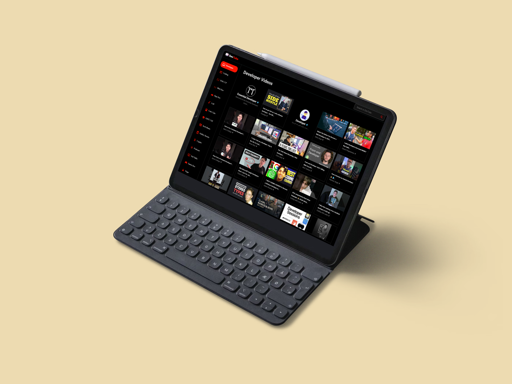

<h2>
  DevTube  
  <b>Favicon Generator</b>
   
  <a href="https://dev-tube.vercel.app" target="_blank">dev-tube.vercel.app</a>
</h2>

  

 

 &nbsp;
 &nbsp;
 &nbsp;
 &nbsp;

<h3 align="center">
    🔹
    <a href="https://github.com/pranjal-barnwal/devTube/issues">Report Bug</a> &nbsp; &nbsp;
    🔹
    <a href="https://github.com/pranjal-barnwal/devTube/issues">Request Feature</a>
</h3>

# DevTube
**DevTube** is a YouTube client specifically designed for developers, providing a tailored experience to meet their needs.

## Built With

    This project was built using these technologies.

    - React Js
    - Material Ui 5
    - Axios
    - React Router Dom
    - Rapid API (YouTube v3 API)

## Features
- Get personalized video recommendations based on your current video selection.
- Rest assured knowing that your data is not tracked.
- Easily access important search tags in the side panel for efficient searching.
- Seamlessly search for and watch videos on any topic of interest.
- Discover amazing channel profiles and explore their content.
- Enjoy full control over video playback, just like on the real YouTube platform.

## **Getting Started**
Clone down this repository. You will need `node.js` and `git` installed globally on your machine.

## **🛠 Installation and Setup Instructions**
1. Installation: `npm install`

2. In the project directory, you can run: `npm start`

Runs the app in the development mode.\
Open [http://localhost:3000](http://localhost:3000) to view it in the browser.
The page will reload if you make edits.

## **Usage Instructions**
Open the project folder and Navigate to `/src/components/`.  
You will find all the components used and you can edit your information accordingly.

## **Show your support**

Hit the ⭐ if you liked this website!

